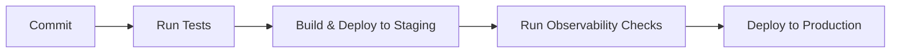

Aquí tienes el README adaptado para tu proyecto de **Asistente Técnico Web Basado en IA y Observabilidad**:

---

# 🛠️ AI-Powered Technical Assistant with Observability

## 📋 Overview
Este proyecto es un sistema de asistencia técnica automatizado que utiliza inteligencia artificial y servicios de observabilidad para monitorear, interpretar y actuar de manera eficiente sobre los logs, métricas y eventos de sistemas complejos. Con tecnologías como Prometheus, Grafana y ELK, se proporciona un enfoque robusto para capturar y analizar datos en tiempo real, permitiendo una toma de decisiones informada y acciones automatizadas.

## 📚 Table of Contents
- [Overview](#overview)
- [Prerequisites](#prerequisites)
- [Installation](#installation)
- [Project Architecture](#project-architecture)
- [Features](#features)
- [Tech Stack & Versions](#tech-stack--versions)
- [API Documentation](#api-documentation)
- [Database Migrations](#database-migrations)
- [Environment Variables](#environment-variables)
- [CI/CD Pipeline](#cicd-pipeline)
- [Contributing](#contributing)
- [License](#license)

## 📌 Prerequisites
Asegúrate de tener instaladas las siguientes versiones en tu entorno de desarrollo:

- **Node.js** >= 18.x
- **Prometheus** >= 2.x
- **Grafana** >= 8.x
- **ElasticSearch** >= 7.x
- **Logstash** >= 7.x

## 🔧 Installation
Clona el repositorio y navega a la carpeta del proyecto:

```bash
git clone https://github.com/yourrepo/ai-technical-assistant.git
cd ai-technical-assistant
```

Instala las dependencias del proyecto:

```bash
npm install
```

Configura las variables de entorno copiando el archivo `.env.example` a `.env`:

```bash
cp .env.example .env
```

Inicia los servicios de monitoreo y análisis:

```bash
docker-compose up -d
```

Inicia el servidor de la IA:

```bash
npm run dev
```

## 🏗️ Project Architecture
Este proyecto sigue una arquitectura basada en servicios de observabilidad y aprendizaje automático, con las siguientes capas principales:

- **Recopilación de datos**: Prometheus para métricas en tiempo real, Logstash para procesamiento de logs, ElasticSearch para almacenamiento y consultas avanzadas, y Grafana para visualización.
- **Inteligencia Artificial**: Modelos de aprendizaje supervisado y NLP (Procesamiento de Lenguaje Natural) para analizar e interpretar datos.
- **Automatización**: Scripts de respuesta automática y reglas de monitoreo configurables que activan alertas y acciones.

### 📂 Project Structure
```
├── src
│   ├── ai                    # Lógica de IA y modelos de NLP
│   ├── monitoring            # Configuración de Prometheus, Grafana, ELK
│   ├── actions               # Scripts y respuestas automatizadas
│   └── api                   # API para integración y comunicación
├── docker-compose.yml        # Contenedor para servicios de observabilidad
└── .env.example              # Variables de entorno
```

## 🚀 Features
- **Monitorización en Tiempo Real**: Captura y análisis de métricas y logs.
- **Análisis Automatizado con IA**: Detección de patrones y predicciones basadas en datos históricos.
- **Respuesta Automática**: Scripts que permiten acciones correctivas o escalado de alertas.
- **Interfaz Visual**: Visualización en Grafana para el estado y alertas de sistemas.

## 🛠️ Tech Stack & Versions
| Backend       | Observability        | AI/NLP      | Infrastructure/DevOps |
|---------------|----------------------|-------------|------------------------|
| Node.js       | Prometheus           | spaCy       | Docker                |
| Express       | Grafana              | TensorFlow  | Docker Compose        |
|               | ELK (Elastic Stack)  | scikit-learn |                        |

## 🌐 API Documentation
La documentación de la API está disponible en:

- **Desarrollo**: http://localhost:3000/api/docs
- **Producción**: https://production-url.com/api/docs

## 🔄 Database Migrations
Administra las migraciones de la base de datos:

```bash
# Crear una nueva migración
npm run migration:create

# Ejecutar migraciones
npm run migration:up

# Revertir migraciones
npm run migration:down
```

## 🔐 Environment Variables
Configuración de variables de entorno esenciales:

```plaintext
# ElasticSearch
ELASTICSEARCH_HOST=localhost
ELASTICSEARCH_PORT=9200

# Prometheus
PROMETHEUS_HOST=localhost
PROMETHEUS_PORT=9090

# Backend
PORT=3000
NODE_ENV=development
```

## 🔄 CI/CD Pipeline
Este proyecto utiliza un pipeline de CI/CD básico:



## 🤝 Contributing
¡Las contribuciones son bienvenidas! Consulta la [Guía de Contribuciones](./CONTRIBUTING.md) para más detalles sobre cómo colaborar en este proyecto.

## 📄 License
Este proyecto está licenciado bajo la Licencia MIT. Consulta el archivo [LICENSE](./LICENSE) para más detalles.

---

Este README proporciona una guía completa para instalar, configurar y contribuir a tu proyecto de **Asistente Técnico Basado en IA y Observabilidad**.
